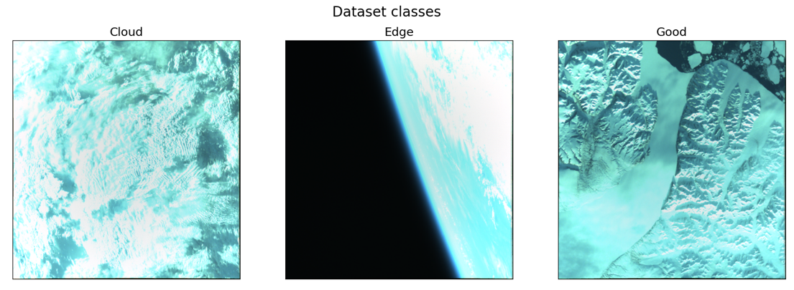

#  Microsat Data Filtering (OMICRON)
 Microsat Data Filtering (OMICRON) aims at performing data-filtering on board a microsatellite .

# Summary

<!-- TABLE OF CONTENTS -->
<details open="open">
  <summary>Table of Contents</summary>
  <ol>
    <li><a href="#about-the-project">About the Project</a></li>
    <li><a href="#project assignment">Project assignment</a></li>
    <ul>
      <li><a href="#project-description">Project description</a></li>
      <li><a href="#functional-requirements">Functional requirements</a></li>
      <li><a href="#performance-requirements">Performance requirements</a></li>
      <li><a href="#deliverables">Deliverables</a></li>
    </ul>
    <li><a href="#content-of-repository">Content of repository</a></li>
    <li><a href="#installation">Installation</a>
    <ul>
      <li><a href="#clone-the-repository-via-git">Clone the repository via Git</a></li>
      <li><a href="#software-installation">Software installation</a></li>
      <li><a href="#activate-your-environment">Activate your environment</a></li>
      <li><a href="#organize-your-project-data">Organize your project data</a></li>
    </ul>
    <li><a href="#data-availability">Data availability</a></li>
    <li><a href="#contributing">Contributing</a></li>
    <li><a href="#license">License</a></li>
    <li><a href="#acknoledgments">Acknoledgments</a></li>
    <li><a href="#contacts">Contacts</a></li>
  </ol>
</details>

# About the project
 Microsat Data Filtering (OMICRON) is a project assignment for the course [MicroSat Engineering (AE4S10)](https://studiegids.tudelft.nl/a101_displayCourse.do?course_id=65838) of [Aerospace Engineering at TU Delft](https://www.tudelft.nl/lr) to perform data-filtering on board a microsatellite by using Machine Learning.
The idea is similar to what has been proposed in the scope of the Φ-[Sat-1](https://ieeexplore.ieee.org/document/9600851) mission, which proposed to use machine learning models to detect cloud-covered images (`Cloud`), so they can be discarded to priviledge cloud-free images.
However, `Cloud` are not the only source of low-information-content. Indeed, microsatellites attitude determination and control systems might experience a failure, which leads the satellite to thumble and produce off-nadir images containg edges of Earth (`Edge`). Therefore, since the information content is rather small, those images can be also discarded to proviledge high-information content images (`Good`). <br>

# Project assignment

## Project description
We want to design a machine learning classification model that will be run on board a future micro-satellite for `Earth Observation` missions aiming at providing images of our planet. The model distinguishes process the images prior to their download and classify them into `Good`, `Edge`, and `Cloud`. Images classified as `Cloud` or `Edge` will be discarded prior to their download. <br>
To train and validate your model, the mission manager will provide you with some data from the [OPS-SAT](https://www.esa.int/Enabling_Support/Operations/OPS-SAT) mission, whose image technology and orbit ensures enough similarity with our future satellite mission. However, such images are **NOT LABELED**. That means, you have to label them (i.e., distinguishing them into the three classes) before you can train your machine learning model. To this aim, this repository includes a Graphical User Interface (GUI) that will help you performing **manual labeling** (refer to [Content of repository](#content-of-repository)). However, more sophisticated labeling strategies are also possible.

An expected labeling for three samples of such images is shown below.




As you can see, the images suffer from atmospheric-distortion, which distorces their histogram so they appear "blue". A radiometric correction chain is not available on board our satellite. Therefore, you can deal with that or you have to implement one on your own in software.

## Functional requirements

1. The OMICRON classifier shall take as input a 256x256x3 image.
2. The OMICRON classifier shall classify correctly between `Good`, `Edge`, and `Cloud`.
3. The OMICRON classifier shall be uploaded on board the micro-satellite in a single pass.
  * **Uplink bandwidth**: 256 kb/s.
  * **Efficacy window lenght**: 6 min (This takes into account average disconnections and overheads in terms of data transmissions due to transmission protocols).

## Performance requirements

1. The accuracy of the OMICRON classifier shall be higher than 80 \%.

## Deliverables
1. **Labeled dayaset**.
2. **Code**. It shall cointain:
   1. Neural Network training pipeline.
   2. Verification of the trained machine learning positive.
   3. Plots of the train and cross-validation split losses.
   4. Plots of the network accuracy on the test split [Recall and Precision](https://en.wikipedia.org/wiki/Precision_and_recall). Here we define a `Good` image as a **Positive**. All the other classes are **Negative**.
  We provide a skeleton for your code [Train.py](https://github.com/GabrieleMeoni/OMICRON/blob/main/notebooks/Train.ipynb). Please, refer to [Content of repository](#content-of-repository).

3. **Final presentation**:
   1. Discussing dataset labeling strategy.
   2. Model architecture.
   3. Training strategy and procedure.
   4. Results in terms of accuracy, Recall and Precision.
   5. Plots of the train and cross-validation split losses.
   6. Discussion about the impact of Recall and Precision metrics in the future micro-satellite mission.
   7. Possible strategies to improve your model.


# Content of repository
The content of repository is as follows:

* `notebooks`: it includes the following notebooks and their `utilities`:
    * `Label_image_GUI.ipynb`: notebook that offers a GUI to manually label your data. Instructions on how to use the GUI are included in the notebook.
    * `Train.ipy`: notebook that includes the skeleton for your solution. You are supposed to expand this notebook with your code. Currently, the notebook includes `Dataset` utilities to load and process your dataset, after you have performed manual labeling.
**N.B**: We recommend using [Jupyter](https://jupyter.org/) to access the notebook
* `resources`: it includes resources (e.g., images) useful for this [README](https://github.com/GabrieleMeoni/OMICRON/blob/main/README.md).
* `utils`: it includes different utils functions that are used by the notebooks. In particular:
    * `data_utils.py`: it contains the `Dataset` class and functions to parse the data. **N.B**: you might not edit this file without a proper reason.
    * `plot_utils.py`: it contains some utils to plot, post-process, and visualize data. You might add additional functions, if needed, for instance to match the output of the model classification to your input images.
* `.gitignore`: it suggests what kind of files should be excluded from the repository.
* `environment.yml`: this is the [environment.yml](https://conda.io/projects/conda/en/latest/user-guide/tasks/manage-environments.html#activating-an-environment) file used to create your [conda](https://docs.conda.io/projects/miniconda/en/latest/) environment. Please, refer to [installation](#installation) for more details on how to use it to create your environment.
* `LICENSE`: license file. For more details, please refer to [LICENSE](#license).
* `README.md`: this [README.md](https://github.com/GabrieleMeoni/OMICRON/blob/main/README.md) file.

# Installation

## Clone the repository via Git

First you need to clone this [repository](https://github.com/GabrieleMeoni/EarthEdgeDetector.git) so you can download its content to your PC.

* First you need to install [Git](https://git-scm.com/downloads) to be able to clone the repository.

* Once you have installed Git, navigate to a directory in your PC where you want to download the repository content.

* Run the following command to clone the repository by using Git.

```git clone https://github.com/GabrieleMeoni/EarthEdgeDetector.git```


## Software installation

Once you haved clone the repository, to install the software, proceed as follows:


* First of all, you need to install [conda](https://docs.conda.io/projects/conda/en/stable/user-guide/install/download.html). Conda is used to create a separate [environment](https://conda.io/projects/conda/en/latest/user-guide/tasks/manage-environments.html#activating-an-environment) for your project containing the packages that are needed for it. This is useful to avoid packages conflicts. Once conda is installed, your console should be in its `base` environent. You should be able to see `(base)` at the left of your console. If not, run `conda init` and restart your console.

* Navigate now to the main directory of the repository, where the `environment.yml` file is located.


* Run the following command to install our environment named `OMICRON` (it might take a while):

```conda env create -f environment.yml```

Please, notice that in addition to other packages, our environment will install [PyTorch](https://pytorch.org/) with CUDA compatibilities to enable the training of your model to be performed with GPU support. We assume that you will implement your code in PyTorch. If not, feel free to install any other software. However, be aware that both our `Dataset` utils and `GUI` are based on PyTorch.


## Activate your environment

* Once the installation is finished, you can activate your environment as follows (**N.B**: this step is the only one that you have to repeat everytime you want to use your environment. ):

``` conda activate OMICRON```

You should see (`OMICRON`) appearing on the left instead of base.

* If you have installed PyTorch, to test whether the installation with CUDA support has been performed correctly, run the following commands in the Python console inside your environment:

    1. `import torch`.
    2. `torch.cuda.is_available()`

If the last command return `True`, the installation with CUDA support has been successful. Otherwise, you can still proceed in using PyTorch by on your CPU.

## Organize your project data
Once you got access to your data, you should:

* Create a new subdirectory in the repository folder called `data`.
* Uncompress the `.zip` file inside the `data` subdirectory.

To get access to the project data, please refer to [Data availability](#data-availability).

# Data availability
Request access to the project data by sending an email (refer to [Contacts](#contacts)). Specify `OMICRON - Request access to data` in your mail object. <br>
The OMICRON dataset has been realized by images by the [OPS-SAT](https://www.esa.int/Enabling_Support/Operations/OPS-SAT) satellite. In particular, the dataset was made of raw unprocessed images from the [The OPS-SAT Case](https://kelvins.esa.int/opssat/challenge/) Kelvins competition with additional `Edge` images. Moreover, we retrieved additional images from the [OPS-SAT Flicker](https://www.flickr.com/photos/esa_events/albums/72157716491073681/), which were reprocessed to have the same blue appearance by applying [histogram matching](https://scikit-image.org/docs/stable/auto_examples/color_exposure/plot_histogram_matching.html). <br>
OPS-SAT images are RGB images with 2048x1942 resolution. Images were split into two halves horizontally to ensure to augment the dataset.

# Contributing
The OMICRON project is open to contributions. To discuss new ideas and applications, please, reach us via email (please, refer to Contacts). To report a bug or request a new feature, please, open an [issue](https://github.com/GabrieleMeoni/EarthEdgeDetector/issues) to report a bug or to request a new feature.

If you want to contribute, please proceed as follow:

* Fork the Project
* Create your Feature Branch (git checkout -b feature/NewFeature)
* Commit your Changes (git commit -m 'Create NewFeature')
* Push to the Branch (git push origin feature/NewFeature)
* Open a Pull Request

# License
Distributed under GPL 3.0 License.

Technische Universiteit Delft hereby disclaims all copyright interest in  Microsat Data Filtering (OMICRON) written by the Author(s).

Henri Werij, Faculty of Aerospace Engineering, Technische Universiteit Delft.

© [2023], [Meoni Gabriele]

# Acknoledgments
We would like to thank Dario Izzo (Advanced Concepts Team, European Space Agency) and David Evans (OPS-SAT, European Space Agency) for providing the data for this assignment.

# Contacts

Created by [Gabriele Meoni](https://www.tudelft.nl/staff/g.meoni/) - G.Meoni@tudelft.nl, Assistant Professor in Space Systems Engineering, Aerospace Engineering, TU Delft.
